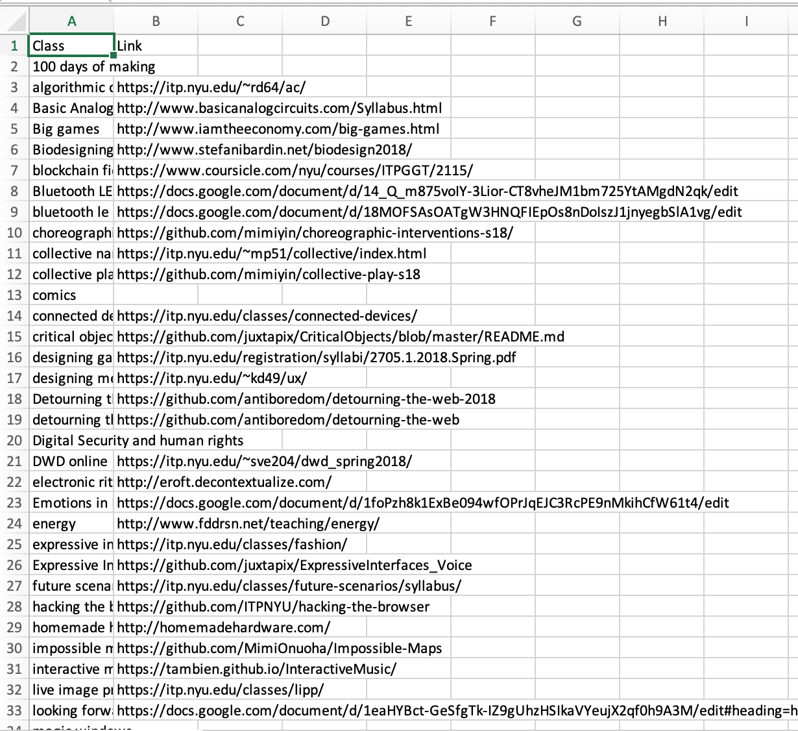
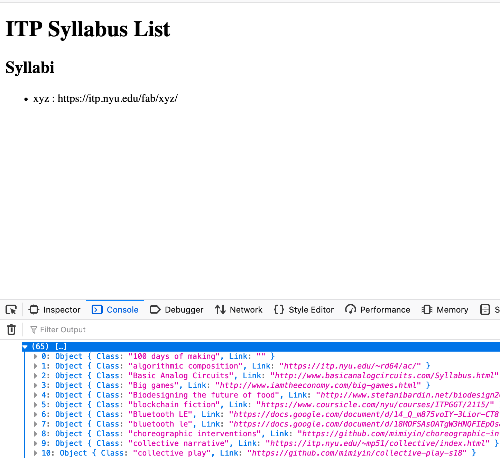

# dwd-itpSyllabusAPI
## DWD Assignment 4

On ITP students-list students curate a shared google spreadsheet with a list of ITP course syllabi. This list is passed down from Year 2's to Year 1's every year. The list gives you course websites something that is missing in the Course Packet emailed by Dante each semester. This list is highly sought for at the time of enrollment and I thought why not make an API out of it for students to access from their websites?

I converted the spreadsheet into a CSV file

Then I converted it into a JSON file using https://csvjson.com/csv2json

The API gives you a list with names of courses and their URL's. 

The API is deployed on [glitch](https://bsehgol-dwd-itpsyllabusapi.glitch.me/) and has a [github repo](https://github.com/bsehgol/dwd-itpSyllabusAPI)

